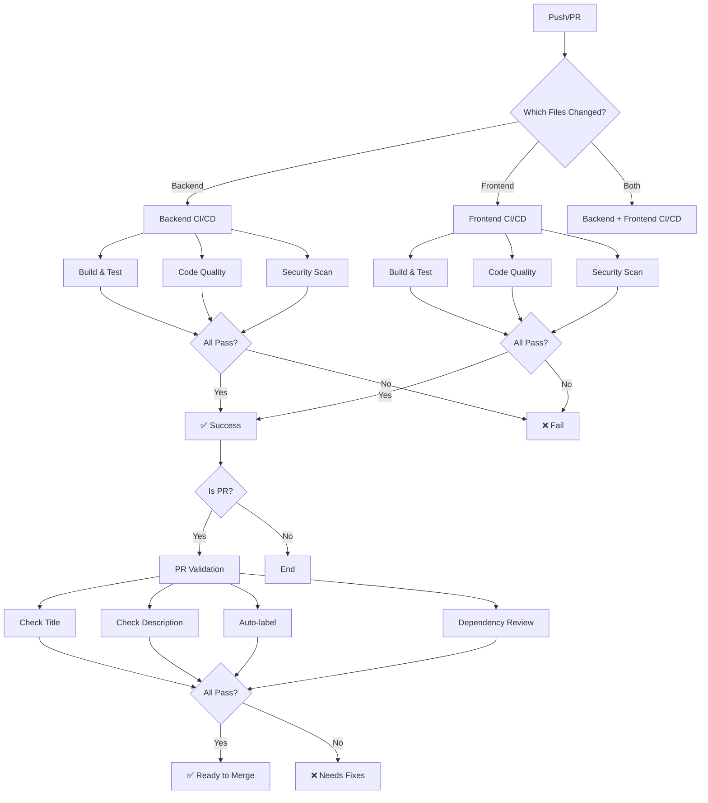

# CI/CD Pipeline Documentation

This document describes the Continuous Integration and Continuous Deployment (CI/CD) pipeline for the WhatsNext project.

## 🔄 Overview

The WhatsNext project uses **GitHub Actions** for automated testing, quality checks, and deployment. The pipeline is split into separate workflows for backend and frontend to ensure fast, parallel execution.

## 📋 Workflows

### 1. Backend CI/CD (`backend-ci.yml`)

**Triggers:**
- Push to `main` or `develop` branches (when backend files change)
- Pull requests to `main` or `develop` branches (when backend files change)

**Jobs:**

#### Build and Test
- ✅ Checkout code
- ✅ Setup .NET 9.0
- ✅ Restore NuGet packages
- ✅ Build solution in Release mode
- ✅ Run unit tests
- ✅ Run integration tests
- ✅ Upload test results

#### Code Quality Check
- ✅ Verify code formatting (`dotnet format`)
- ✅ Run code analysis (StyleCop, Analyzers)
- ✅ Enforce coding standards

#### Security Scan
- ✅ Check for vulnerable NuGet packages
- ✅ Scan transitive dependencies
- ✅ Fail if vulnerabilities found

**Status Badge:**
```markdown
[](https://github.com/yourusername/whatsnext/actions)
```

---

### 2. Frontend CI/CD (`frontend-ci.yml`)

**Triggers:**
- Push to `main` or `develop` branches (when frontend files change)
- Pull requests to `main` or `develop` branches (when frontend files change)

**Jobs:**

#### Build and Test
- ✅ Checkout code
- ✅ Setup Node.js 20.x
- ✅ Install npm dependencies
- ✅ TypeScript type checking
- ✅ Lint code with ESLint
- ✅ Check Prettier formatting
- ✅ Build production bundle
- ✅ Upload build artifacts

#### Code Quality Check
- ✅ Run all validations (`npm run validate`)
- ✅ Ensure code meets quality standards

#### Security Scan
- ✅ Audit npm dependencies
- ✅ Check for outdated packages
- ✅ Fail on moderate+ vulnerabilities

**Status Badge:**
```markdown
[](https://github.com/yourusername/whatsnext/actions)
```

---

### 3. Pull Request Validation (`pr-validation.yml`)

**Triggers:**
- Pull request opened, synchronized, or reopened

**Jobs:**

#### Validate PR
- ✅ Check PR title follows conventional commits
- ✅ Ensure PR has meaningful description (20+ chars)
- ✅ Analyze changed files
- ✅ Generate summary report

#### Label PR
- ✅ Auto-label based on changed files
- ✅ Labels: `backend`, `frontend`, `documentation`, `ci/cd`, `dependencies`, `configuration`, `database`, `tests`

**Conventional Commit Types:**
- `feat`: New feature
- `fix`: Bug fix
- `docs`: Documentation changes
- `style`: Code style changes (formatting, etc.)
- `refactor`: Code refactoring
- `perf`: Performance improvements
- `test`: Adding or updating tests
- `build`: Build system changes
- `ci`: CI/CD changes
- `chore`: Other changes (dependencies, etc.)
- `revert`: Revert previous commit

---

### 4. Dependency Review (`dependency-review.yml`)

**Triggers:**
- Pull requests to `main` branch

**Jobs:**

#### Review Dependencies
- ✅ Scan for new dependencies
- ✅ Check for known vulnerabilities
- ✅ Deny GPL-2.0 and GPL-3.0 licenses
- ✅ Fail on moderate+ severity
- ✅ Comment summary in PR

---

## 🎯 Quality Gates

### Backend Quality Gates

1. **Build Success**: Solution must build without errors
2. **Test Coverage**: All tests must pass
3. **Code Formatting**: Must pass `dotnet format --verify-no-changes`
4. **Code Analysis**: StyleCop and analyzer warnings are tracked
5. **Security**: No vulnerable packages allowed

### Frontend Quality Gates

1. **Type Safety**: TypeScript must compile without errors (`npm run type-check`)
2. **Linting**: ESLint must pass with 0 warnings (`npm run lint`)
3. **Formatting**: Prettier must pass (`npm run format:check`)
4. **Build Success**: Vite build must succeed
5. **Security**: npm audit must pass (moderate+ vulnerabilities fail)

### Pull Request Quality Gates

1. **Conventional Commits**: PR title must follow conventional commit format
2. **Description**: PR must have meaningful description (20+ characters)
3. **Labels**: PR is automatically labeled based on changed files
4. **Dependencies**: New dependencies are reviewed for vulnerabilities and licenses

---

## 🚀 Branch Strategy

### Main Branches

- **`main`**: Production-ready code
  - Protected branch
  - Requires PR approval
  - All CI checks must pass
  - Auto-deploys to production (future)

- **`develop`**: Integration branch for features
  - Protected branch
  - Requires PR approval
  - All CI checks must pass
  - Auto-deploys to staging (future)

### Supporting Branches

- **`feature/*`**: New features
  - Branch from: `develop`
  - Merge to: `develop`
  - Example: `feature/habit-tracker`

- **`bugfix/*`**: Bug fixes
  - Branch from: `develop`
  - Merge to: `develop`
  - Example: `bugfix/task-priority-sort`

- **`hotfix/*`**: Critical production fixes
  - Branch from: `main`
  - Merge to: `main` and `develop`
  - Example: `hotfix/security-vulnerability`

- **`release/*`**: Release preparation
  - Branch from: `develop`
  - Merge to: `main` and `develop`
  - Example: `release/1.0.0`

---

## 📊 CI/CD Workflow Diagram



---

## 🔐 Secrets and Environment Variables

### Required Secrets (Future)

- `GITHUB_TOKEN`: Automatically provided by GitHub Actions
- `DEPLOY_KEY`: SSH key for deployment (to be added)
- `DATABASE_CONNECTION_STRING`: Production database (to be added)
- `JWT_SECRET_KEY`: JWT signing key (to be added)

### Environment Variables

Configured in workflow files:
- `DOTNET_VERSION`: .NET SDK version (9.0.x)
- `NODE_VERSION`: Node.js version (20.x)
- `SOLUTION_PATH`: Path to .NET solution
- Database provider settings (in appsettings)

---

## 📈 Performance Optimization

### Caching Strategies

1. **Node.js Dependencies**:
   ```yaml
   - uses: actions/setup-node@v4
     with:
       cache: 'npm'
       cache-dependency-path: './frontend/package-lock.json'
   ```

2. **.NET Dependencies**: NuGet packages are cached automatically by `dotnet restore`

### Parallel Execution

- Backend and frontend workflows run in parallel
- Multiple jobs within each workflow run in parallel
- Reduces total CI time significantly

### Conditional Execution

- Workflows only run when relevant files change
- Backend workflow skips if only frontend files changed
- Frontend workflow skips if only backend files changed

---

## 🧪 Testing Strategy

### Backend Tests

1. **Unit Tests**:
   - Test individual components in isolation
   - No external dependencies
   - Fast execution
   - Filter: `FullyQualifiedName~UnitTests`

2. **Integration Tests**:
   - Test component interactions
   - Use in-memory database
   - Test API endpoints
   - Filter: `FullyQualifiedName~IntegrationTests`

### Frontend Tests (To be implemented)

1. **Unit Tests**: Component testing with React Testing Library
2. **Integration Tests**: Feature testing with user interactions
3. **E2E Tests**: Full user flow testing with Playwright (future)

---

## 📝 Local CI Testing

### Test Backend CI Locally

```bash
cd backend

# Restore and build
dotnet restore
dotnet build --configuration Release

# Run tests
dotnet test --configuration Release --filter "FullyQualifiedName~UnitTests"
dotnet test --configuration Release --filter "FullyQualifiedName~IntegrationTests"

# Check formatting
dotnet format --verify-no-changes

# Check for vulnerable packages
dotnet list package --vulnerable --include-transitive
```

### Test Frontend CI Locally

```bash
cd frontend

# Install dependencies
npm ci

# Run all checks
npm run type-check
npm run lint
npm run format:check
npm run build

# Or run all at once
npm run validate

# Check for vulnerabilities
npm audit
npm outdated
```

---

## 🔄 Future Enhancements

### Planned CI/CD Improvements

1. **Code Coverage**:
   - ✅ Collect coverage data
   - ⏳ Enforce minimum coverage (80%)
   - ⏳ Upload to Codecov

2. **Performance Testing**:
   - ⏳ Lighthouse CI for frontend
   - ⏳ API performance benchmarks

3. **Deployment**:
   - ⏳ Auto-deploy to staging on merge to `develop`
   - ⏳ Auto-deploy to production on merge to `main`
   - ⏳ Blue-green deployment strategy
   - ⏳ Rollback capabilities

4. **Monitoring**:
   - ⏳ Build time tracking
   - ⏳ Test failure trends
   - ⏳ Dependency update notifications

5. **Advanced Testing**:
   - ⏳ Visual regression testing
   - ⏳ E2E tests with Playwright
   - ⏳ Load testing

6. **Release Automation**:
   - ⏳ Automatic version bumping
   - ⏳ Changelog generation
   - ⏳ GitHub Releases creation
   - ⏳ Docker image publishing

---

## 🐛 Troubleshooting CI Failures

### Backend Build Failures

**Error: Build failed**
```bash
# Solution: Check compiler errors in logs
# Common causes:
# - Missing package references
# - Syntax errors
# - Version mismatches
```

**Error: Tests failed**
```bash
# Solution: Run tests locally
cd backend
dotnet test --verbosity detailed

# Check for:
# - Database connection issues
# - Missing test data
# - Flaky tests
```

**Error: Format verification failed**
```bash
# Solution: Format code locally
cd backend
dotnet format

# Commit and push
git add .
git commit -m "style: apply code formatting"
git push
```

### Frontend Build Failures

**Error: Type check failed**
```bash
# Solution: Fix TypeScript errors
cd frontend
npm run type-check

# Common causes:
# - Missing type definitions
# - Incorrect prop types
# - Null/undefined handling
```

**Error: Linting failed**
```bash
# Solution: Fix ESLint errors
cd frontend
npm run lint:fix

# Commit and push
git add .
git commit -m "style: fix linting issues"
git push
```

**Error: npm audit failed**
```bash
# Solution: Update vulnerable packages
cd frontend
npm audit fix

# Or manually update specific packages
npm update <package-name>

# Commit and push
git add package*.json
git commit -m "build: update dependencies"
git push
```

### PR Validation Failures

**Error: Invalid PR title**
```bash
# Solution: Update PR title to follow conventional commits
# Format: <type>(<scope>): <description>
# Example: feat(habits): add streak tracking
```

**Error: PR description too short**
```bash
# Solution: Add meaningful description
# - What changes were made?
# - Why were they made?
# - How were they tested?
```

---

## 📚 Resources

- [GitHub Actions Documentation](https://docs.github.com/en/actions)
- [Conventional Commits](https://www.conventionalcommits.org/)
- [Semantic Pull Requests](https://github.com/amannn/action-semantic-pull-request)
- [Dependency Review Action](https://github.com/actions/dependency-review-action)

---

## ✅ CI/CD Checklist

- [x] Backend CI/CD workflow
- [x] Frontend CI/CD workflow
- [x] Pull request validation
- [x] Dependency review
- [x] Auto-labeling
- [x] Security scanning
- [x] Code quality checks
- [ ] Code coverage enforcement (future)
- [ ] Automatic deployment (future)
- [ ] E2E testing (future)
- [ ] Performance testing (future)

---

## 🎉 Summary

The WhatsNext CI/CD pipeline ensures:
- ✅ **Quality**: All code is tested, linted, and formatted
- ✅ **Security**: Dependencies are scanned for vulnerabilities
- ✅ **Consistency**: Coding standards are enforced
- ✅ **Automation**: Manual steps are minimized
- ✅ **Fast Feedback**: Developers know quickly if changes break anything
- ✅ **Documentation**: PRs are well-documented and labeled

For questions or improvements, please open an issue or PR!

