# WhatsNext Architecture Documentation

## Overview

WhatsNext follows **Clean Architecture** principles (also known as Onion Architecture or Hexagonal Architecture) to ensure maintainability, testability, and independence from external frameworks.

## Architecture Principles

### Core Principles
1. **Independence**: Business logic independent of UI, database, and external services
2. **Testability**: Easy to test without UI, database, or external dependencies
3. **Separation of Concerns**: Clear boundaries between layers
4. **Dependency Rule**: Dependencies point inward toward the domain

### Dependency Flow
```
API (Presentation) → Infrastructure → Application → Domain
                                                      ↑
                                            (All layers depend on Domain)
```

---

## System Architecture (C4 Model)

### Level 1: System Context Diagram

```mermaid
graph TB
    User[👤 User<br/>Web Browser]
    Dashboard[WhatsNext Dashboard<br/>Personal Productivity System]
    WeatherAPI[☁️ Weather API<br/>OpenWeatherMap]
    QuoteAPI[💭 Quote API<br/>ZenQuotes]
    EmailService[📧 Email Service<br/>SendGrid]
    Database[(🗄️ SQL Server/PostgreSQL<br/>User Data)]
    
    User -->|Uses| Dashboard
    Dashboard -->|Fetches Weather| WeatherAPI
    Dashboard -->|Fetches Quotes| QuoteAPI
    Dashboard -->|Sends Notifications| EmailService
    Dashboard -->|Stores/Retrieves| Database
    
    style Dashboard fill:#3B82F6,stroke:#1E40AF,stroke-width:3px,color:#fff
    style User fill:#10B981,stroke:#059669,color:#fff
    style Database fill:#F59E0B,stroke:#D97706,color:#fff
```



### Level 2: Container Diagram


### Level 3: Component Diagram (Backend)


---

## Backend Architecture

### Clean Architecture Layers

#### 1. Domain Layer (Core)
**Location**: `backend/src/WhatsNext.Domain/`

**Responsibilities**:
- Define business entities
- Define value objects
- Define domain events
- Define enums and exceptions
- Contains NO external dependencies

**Structure**:
```
WhatsNext.Domain/
├── Common/
│   ├── BaseEntity.cs
│   └── AuditableEntity.cs
├── Entities/
│   ├── User.cs
│   ├── Habit.cs
│   ├── HabitCompletion.cs
│   ├── TodoTask.cs
│   ├── TimerSession.cs
│   └── Quote.cs
├── ValueObjects/
├── Enums/
│   ├── HabitFrequency.cs
│   ├── TaskPriority.cs
│   ├── TaskStatus.cs
│   └── SessionType.cs
├── Events/
└── Exceptions/
```

**Dependencies**: None (Pure C# / .NET)

#### 2. Application Layer
**Location**: `backend/src/WhatsNext.Application/`

**Responsibilities**:
- Define use cases (Commands and Queries)
- Implement CQRS pattern with MediatR
- Define interfaces for infrastructure
- Implement validation logic
- Define DTOs and mapping profiles

**Structure**:
```
WhatsNext.Application/
├── Common/
│   ├── Interfaces/
│   │   ├── IApplicationDbContext.cs
│   │   ├── IDateTime.cs
│   │   └── ICurrentUserService.cs
│   ├── Models/
│   │   ├── Result.cs
│   │   └── PaginatedList.cs
│   └── Behaviors/
│       ├── ValidationBehavior.cs
│       └── LoggingBehavior.cs
├── Features/
│   ├── Auth/
│   │   ├── Commands/
│   │   │   ├── LoginCommand.cs
│   │   │   └── RegisterCommand.cs
│   │   └── Queries/
│   ├── Habits/
│   │   ├── Commands/
│   │   │   ├── CreateHabitCommand.cs
│   │   │   ├── UpdateHabitCommand.cs
│   │   │   ├── DeleteHabitCommand.cs
│   │   │   └── CompleteHabitCommand.cs
│   │   └── Queries/
│   │       ├── GetHabitsQuery.cs
│   │       └── GetHabitByIdQuery.cs
│   ├── Tasks/
│   ├── Timer/
│   └── Quotes/
├── Mappings/
│   └── MappingProfile.cs
└── DependencyInjection.cs
```

**Dependencies**: Domain Layer, MediatR, FluentValidation, AutoMapper

#### 3. Infrastructure Layer
**Location**: `backend/src/WhatsNext.Infrastructure/`

**Responsibilities**:
- Implement data access (EF Core)
- Implement external service integrations
- Implement repositories
- Configure database migrations

**Structure**:
```
WhatsNext.Infrastructure/
├── Persistence/
│   ├── Contexts/
│   │   └── ApplicationDbContext.cs
│   ├── Configurations/
│   │   ├── UserConfiguration.cs
│   │   ├── HabitConfiguration.cs
│   │   └── TaskConfiguration.cs
│   ├── Repositories/
│   │   ├── HabitRepository.cs
│   │   └── TaskRepository.cs
│   ├── Migrations/
│   └── Seeders/
│       └── DataSeeder.cs
├── Services/
│   ├── DateTimeService.cs
│   ├── WeatherService.cs
│   ├── EmailService.cs
│   └── QuoteService.cs
└── DependencyInjection.cs
```

**Dependencies**: Application Layer, Domain Layer, EF Core, External APIs

#### 4. Presentation Layer (API)
**Location**: `backend/src/WhatsNext.API/`

**Responsibilities**:
- Expose HTTP endpoints
- Handle authentication and authorization
- Implement middleware
- Configure Swagger/OpenAPI
- Handle errors globally

**Structure**:
```
WhatsNext.API/
├── Controllers/
│   ├── AuthController.cs
│   ├── HabitsController.cs
│   ├── TasksController.cs
│   ├── TimerController.cs
│   └── QuotesController.cs
├── Middleware/
│   ├── ExceptionHandlingMiddleware.cs
│   └── PerformanceMiddleware.cs
├── Filters/
│   ├── ApiExceptionFilterAttribute.cs
│   └── ValidateModelAttribute.cs
├── Extensions/
│   └── ServiceCollectionExtensions.cs
├── appsettings.json
├── appsettings.Development.json
└── Program.cs
```

**Dependencies**: Application Layer, Infrastructure Layer

---

## Frontend Architecture

### Component Hierarchy


### Frontend Structure

```
frontend/
├── src/
│   ├── components/
│   │   ├── common/
│   │   │   ├── Button/
│   │   │   ├── Input/
│   │   │   ├── Modal/
│   │   │   ├── Card/
│   │   │   └── LoadingSpinner/
│   │   ├── layout/
│   │   │   ├── Header/
│   │   │   ├── Sidebar/
│   │   │   ├── Footer/
│   │   │   └── MainLayout/
│   │   └── features/
│   │       ├── habits/
│   │       │   ├── HabitCard.tsx
│   │       │   ├── HabitList.tsx
│   │       │   ├── HabitForm.tsx
│   │       │   └── HabitCalendar.tsx
│   │       ├── tasks/
│   │       ├── timer/
│   │       └── quotes/
│   ├── pages/
│   │   ├── Dashboard/
│   │   ├── Habits/
│   │   ├── Tasks/
│   │   ├── Timer/
│   │   └── Auth/
│   │       ├── Login.tsx
│   │       └── Register.tsx
│   ├── hooks/
│   │   ├── useAuth.ts
│   │   ├── useHabits.ts
│   │   ├── useTasks.ts
│   │   └── useTimer.ts
│   ├── services/
│   │   ├── api.ts
│   │   └── endpoints/
│   │       ├── auth.ts
│   │       ├── habits.ts
│   │       ├── tasks.ts
│   │       └── timer.ts
│   ├── stores/
│   │   ├── authStore.ts
│   │   └── uiStore.ts
│   ├── types/
│   │   ├── habit.ts
│   │   ├── task.ts
│   │   ├── user.ts
│   │   └── timer.ts
│   ├── utils/
│   │   ├── formatters.ts
│   │   ├── validators.ts
│   │   └── constants.ts
│   ├── styles/
│   │   └── global.css
│   ├── App.tsx
│   └── main.tsx
```

---

## Data Flow

### CQRS Pattern


### Authentication Flow


---

## Database Schema

### Entity Relationship Diagram


---

## Security Architecture

### Authentication & Authorization

1. **JWT-based Authentication**
   - Access tokens (short-lived: 15 minutes)
   - Refresh tokens (long-lived: 7 days)
   - Tokens stored in httpOnly cookies (frontend)

2. **Password Security**
   - BCrypt hashing with salt
   - Minimum complexity requirements
   - Rate limiting on login attempts

3. **API Security**
   - HTTPS enforcement
   - CORS configuration
   - Rate limiting per IP/user
   - Input validation
   - SQL injection prevention (EF Core parameterization)
   - XSS protection

### Security Measures


---

## Deployment Architecture

### Development Environment
```
Local Machine
├── Backend: https://localhost:7001
├── Frontend: http://localhost:5173
└── Database: LocalDB / Docker PostgreSQL
```

### Production Environment
```
Cloud Infrastructure
├── Frontend: Vercel (Static Hosting + CDN)
├── Backend: Azure App Service / AWS ECS
├── Database: Azure SQL / AWS RDS PostgreSQL
├── Cache: Azure Redis / AWS ElastiCache (Optional)
└── Monitoring: Application Insights / CloudWatch
```

### CI/CD Pipeline


---

## Performance Considerations

### Backend Optimization
- **Caching**: Redis for frequently accessed data
- **Database Indexing**: On UserId, Email, foreign keys
- **Pagination**: Implement cursor-based pagination
- **Async/Await**: All I/O operations are async
- **Connection Pooling**: EF Core connection pooling

### Frontend Optimization
- **Code Splitting**: Route-based lazy loading
- **Image Optimization**: WebP format, lazy loading
- **Bundle Size**: Tree shaking, minification
- **Caching**: Service Worker for PWA
- **Virtual Scrolling**: For large lists

---

## Monitoring & Observability

### Metrics to Track
- API response times (p50, p95, p99)
- Error rates by endpoint
- Database query performance
- User activity patterns
- Feature usage statistics

### Logging Strategy
- **Structured Logging**: Serilog with JSON output
- **Log Levels**: Debug, Information, Warning, Error, Critical
- **Correlation IDs**: Track requests across services
- **Sensitive Data**: Mask PII in logs

---

## Testing Strategy

### Backend Testing Pyramid
```
        /\
       /  \  E2E Tests (Playwright)
      /    \
     /      \  Integration Tests (API + DB)
    /        \
   /          \  Unit Tests (Domain + Application)
  /____________\
```

### Test Coverage Goals
- **Domain Layer**: 100% (pure business logic)
- **Application Layer**: >90% (CQRS handlers)
- **Infrastructure Layer**: >70% (repository implementations)
- **API Layer**: >80% (endpoint integration tests)

---

## Future Enhancements

### Phase 2
- Real-time updates (SignalR/WebSockets)
- Offline-first PWA capabilities
- Advanced analytics dashboard
- Machine learning habit predictions

### Phase 3
- Mobile apps (React Native)
- Third-party integrations (Google Calendar, Todoist)
- Team/Family sharing features
- Gamification elements

---

## Architectural Decision Records (ADRs)

### ADR-001: Choose Clean Architecture
**Status**: Accepted  
**Context**: Need maintainable, testable codebase  
**Decision**: Implement Clean Architecture with CQRS  
**Consequences**: Improved testability, clear separation of concerns, steeper learning curve

### ADR-002: Use EF Core over Dapper
**Status**: Accepted  
**Context**: Need ORM for data access  
**Decision**: Use EF Core for productivity and migrations  
**Consequences**: Easier development, potential performance trade-offs

### ADR-003: JWT Authentication
**Status**: Accepted  
**Context**: Need stateless authentication  
**Decision**: Implement JWT with refresh tokens  
**Consequences**: Scalable, stateless, requires token management

---

## References

- [Clean Architecture by Robert C. Martin](https://blog.cleancoder.com/uncle-bob/2012/08/13/the-clean-architecture.html)
- [Microsoft .NET Architecture Guides](https://docs.microsoft.com/en-us/dotnet/architecture/)
- [C4 Model for Software Architecture](https://c4model.com/)
- [CQRS Pattern](https://docs.microsoft.com/en-us/azure/architecture/patterns/cqrs)

---

**Last Updated**: October 7, 2025  
**Version**: 1.0  
**Maintained By**: Development Team

